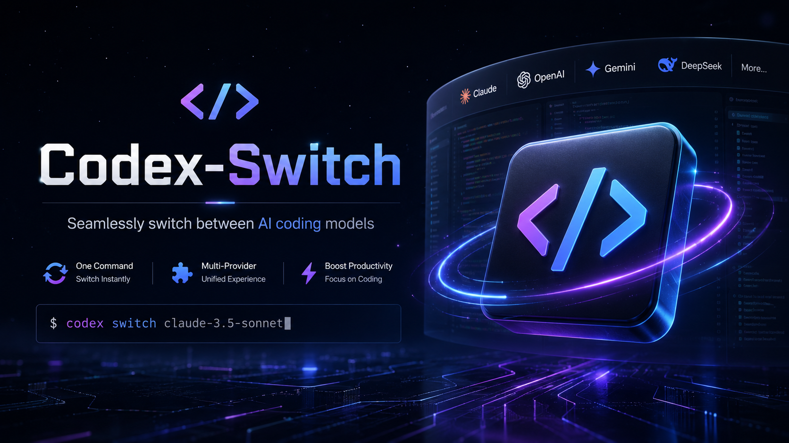

<div align="center">



[](https://github.com/LeenixP/Codex-Bridge/actions/workflows/ci.yml)
[](LICENSE)
[](https://github.com/LeenixP/Codex-Bridge/releases)

Codex Desktop / CLI 的本地协议桥接工具 —— 将 OpenAI Chat 和 Anthropic API 转换为 OpenAI Responses 格式。

</div>

## 说明

Codex-Bridge 在本地 `127.0.0.1` 运行代理服务，接收来自 Codex 的 Responses API 请求，将其转换为 OpenAI Chat Completions 或 Anthropic Messages 格式发送到上游，再将响应转换回 Responses API SSE 事件流。

```
Codex Desktop  →  cc-switch  →  Codex-Bridge  →  上游 API
                (配置管理)     (协议桥接)       (Chat / Anthropic)
```

## 功能

- **多协议支持** — OpenAI Chat Completions 与 Anthropic Messages API
- **厂商预设** — DeepSeek 等厂商内置专属优化（reasoning 回传、双端点切换）；新增厂商只需添加数据条目
- **流式传输** — 完整 SSE 流式响应，实时文本、推理和工具调用事件
- **思考 / 推理** — Anthropic extended thinking 映射为 Codex reasoning 面板展示
- **工具调用** — 双向工具调用转换（`function_call` ↔ `tool_use`）
- **多模态支持** — 图片输入透传至 OpenAI 和 Anthropic
- **Provider 管理** — 添加、编辑、删除、切换多个 API 供应商
- **事件追踪** — 实时请求日志，包含模型、协议、成功/失败状态
- **系统托盘** — 后台运行，右键菜单快速切换供应商
- **cc-switch 集成** — 作为 cc-switch 下游，模型路由 + 协议桥接，cc-switch 管理所有 Codex 配置
- **跨平台** — Windows、macOS、Linux（x64 + arm64）

## 安装

从 [Releases](https://github.com/LeenixP/Codex-Bridge/releases) 下载对应平台的最新版本。

| 平台 | 格式 |
|------|------|
| Windows x64 | Setup exe |
| Linux x64 / arm64 | AppImage、deb |
| macOS (universal) | dmg、tar.gz、zip |

## 使用

1. 启动 Codex-Bridge
2. 添加 Provider（选择预设或自定义、填写 API Key 和模型名）
3. 侧边栏点击「启动代理」
4. 在 cc-switch 中配置 Base URL 为 `http://127.0.0.1:8629/v1`，模型名与 Provider 中的模型名一致

> Codex-Bridge 是纯 API 代理，不修改 `~/.codex/` 下的任何配置文件。配置管理由 cc-switch 负责。

## 开发

```bash
# 安装依赖
npm install

# 启动应用
npm start

# 语法检查 / 测试 / Lint
npm run check
npm test
npm run lint

# 格式化代码
npm run format

# 生成图标
npm run icons

# 构建当前平台
npm run dist
```

## 项目结构

```
src/
├── electron/       # 桌面外壳（窗口、托盘、IPC）
├── proxy/          # HTTP 代理服务器
│   ├── core/       # 编排器、SSE 桥接、事件模型
│   ├── adapters/   # 协议适配器（openai-chat、anthropic）
│   └── presets/    # 厂商预设注册表（DeepSeek 等厂商专属优化）
├── ui/             # 管理面板（HTML/CSS/JS）
│   └── assets/     # 图标资源
└── shared/         # 配置、日志、工具函数
```

## 故障排除

| 问题 | 解决方案 |
|------|---------|
| 代理无法启动 | 检查端口 8629 是否被占用 |
| Codex 未通过代理路由 | 检查 cc-switch 中 Base URL 是否指向 `http://127.0.0.1:8629/v1` |
| 连接测试失败 | 验证 API Key 和 Base URL，确认上游服务可达 |
| 模型不匹配 | 确保 cc-switch 中的模型名与 Codex-Bridge Provider 中的模型名一致 |

## 贡献

欢迎贡献！详见 [CONTRIBUTING.md](CONTRIBUTING.md)。

## 致谢

本项目参考了以下优秀项目：

- [CodeSeeX](https://github.com/tastesteak/codeseex) — Codex 协议桥接与模型管理
- [cc-switch](https://github.com/RadiaxJ/cc-switch) — Tauri 实现的 Codex 代理切换工具

特别感谢 [@tastesteak](https://github.com/tastesteak) 和 [@RadiaxJ](https://github.com/RadiaxJ) 在协议适配和配置文件注入方面的开创性工作。

## 许可证

MIT
